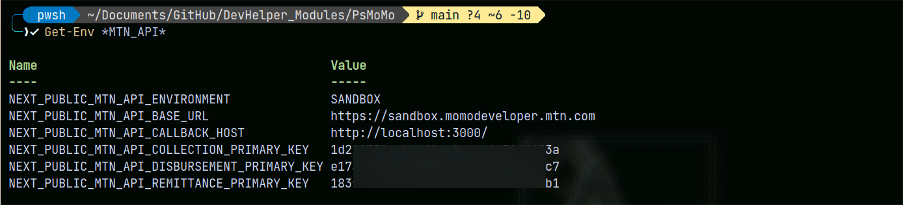

# Module wiki

[PsMoMo.psm1](https://github.com/alainQtec/PsMoMo/blob/main/PsMoMo.psm1) was
build to make multithreading easy and fun.

## Usage examples

```PowerShell
Import-Module dotEnv
read-Env | Set-Env
```

Check to make sure all env variables are loaded

```PowerShell
Get-Env *MTN_API*
```

You should see something like: 

## Running tests

### Local test

Handy when you want to test stuff before pushing to remote.

Intergration, Freature and module tests:

```PowerShell
build.ps1 -Task test
```

Or if you are just want to test a new change you made in pwsh before commit.
then create `preBuild.ps1` and paste the following script.

```PowerShell
Write-Host "[+] Test Module Import ..." -f Green
[IO.Path]::Combine((Split-Path $MyInvocation.MyCommand.Path),"PsMoMo.psm1") | Import-Module
Write-Host "    Done." -f DarkGreen
# Do other stuff with the module ...
```

run the script

```PowerShell
./preBuild.ps1
```

If all your functions work fine, build the module.
